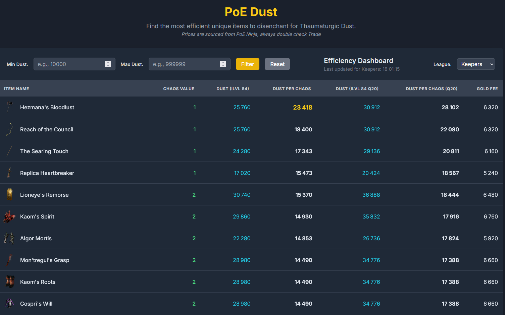

# PoE Dust

A single-page web application designed to help Path of Exile players find the most cost-effective unique items to vendor for Thaumaturgic Dust. The tool fetches live market data and calculates the "Dust per Chaos Orb" ratio, allowing users to easily identify the best items to purchase for disenchanting in Kingsmarch 3.26

Initially posted on Reddit, then removed as it was not taken as a "good tool". Here if anyone wants to use it anyway.

**Live Site:** [https://www.poedust.com](https://www.poedust.com)



---

## Features

-   **Live Price Data:** Integrates directly with the poe.ninja API to fetch Chaos Orb values for unique items.
-   **Efficiency Calculation:** Automatically calculates and displays the "Dust per Chaos" ratio for each item, highlighting the most efficient options.
-   **League Selection:** Supports multiple leagues, including the current challenge league and Standard, with a simple dropdown menu.
-   **Dynamic Sorting:** All table columns can be sorted in ascending or descending order with a single click.
-   **Fully Responsive:** The layout seamlessly transforms from a desktop table view to a mobile-friendly "card" view for easy use on any device.
-   **Comprehensive Item List:** Utilizes a complete, externally managed JSON file containing disenchantment values for all relevant unique items.

---

## How It Works

This project is built with a simple but effective stack, designed for easy maintenance and deployment on static hosting platforms like GitHub Pages.

-   **Frontend:** The entire application is a single `index.html` file built with **Vanilla JavaScript (ES6+)** for logic and **Tailwind CSS** for styling.
-   **Static Data:** Item disenchantment values are stored in a local `item_data.json` file. This file is generated by a Python script, which parses raw data from PoEDB into a structured JSON format.
-   **Live Data APIs:**
    -   **poe.ninja API:** Used to fetch live item prices (Chaos Value).
    -   **Path of Exile API:** Used to fetch the current list of active leagues.
-   **CORS Proxy:** All API calls are routed through a CORS (Cross-Origin Resource Sharing) proxy. This is necessary because web browsers block direct JavaScript requests from one domain (`poedust.com`) to another (`poe.ninja`) for security reasons. The proxy adds the required headers to make these requests possible.

---

## Development Setup

To run this project locally, you will need a local web server. You cannot simply open the `index.html` file in your browser due to browser security restrictions (CORS) on `fetch()` requests for local files.

1.  **Clone the repository:**
    ```bash
    git clone [https://github.com/your-username/your-repository.git](https://github.com/your-username/your-repository.git)
    cd your-repository
    ```

2.  **Start a local web server.** If you have Python installed, you can easily start one from the project's root directory:

    **Python 3:**
    ```bash
    python -m http.server
    ```

    **Python 2:**
    ```bash
    python -m SimpleHTTPServer
    ```

3.  **Open the site:** Navigate to `http://localhost:8000` in your web browser.

---

## AI-Assisted Development

A significant portion of this project was developed in collaboration with a large language model (LLM - Gemini 2.5Pro). This process involved:

-   **Initial Scaffolding:** The AI generated the initial `index.html` structure and the JavaScript functions for fetching and processing data.
-   **Problem Solving & Debugging:** When encountering issues like CORS errors, API data parsing, or JavaScript logic bugs, the AI provided solutions and code modifications.
-   **Iterative Refinement:** New features, such as mobile responsiveness and dynamic sorting, were implemented through a conversational process of describing the desired outcome and having the AI generate the necessary CSS and JavaScript.
-   **Scripting:** The Python script used to process the raw item data into JSON was also generated by the AI based on the specified input and desired output formats.

This project serves as a practical example of how AI can be leveraged as a powerful co-developer tool to accelerate development and build functional applications, even with limited prior programming experience.

note AI assistant for small mods by Moubai : Le Chat by Mitral.ai with free account.
---

## Acknowledgements

-   **Data Sources:**
    -   Live market data provided by the excellent [poe.ninja](https://poe.ninja) API.
    -   Base disenchantment values sourced from [PoEDB](https://poedb.tw/us/Kingsmarch#Disenchant).
-   **Tools:**
    -   Styling by [Tailwind CSS](https://tailwindcss.com/).
    -   Proxy services from [corsproxy.io](https://corsproxy.io/).


